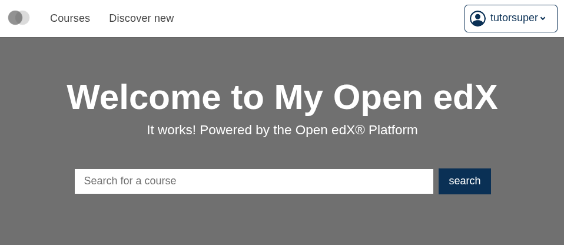
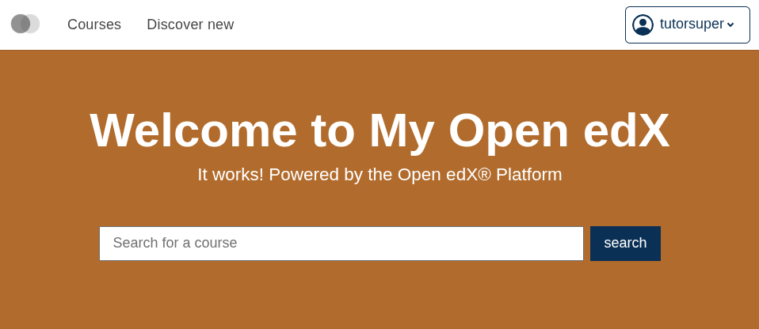

# brand-catalog-background

A Paragon brand package for [`frontend-app-catalog`](https://github.com/openedx/frontend-app-catalog) — overrides the home page banner's background color.

This brand exists as a concrete artifact for the talk *Design Tokens: Plugin Slots but for your CSS*. It demonstrates that an MFE which ships its own application tokens can be re-targeted by a brand package at runtime, without touching the MFE's component code.

## What it overrides

| Token | MFE default | This brand |
|---|---|---|
| `--catalog-home-page-banner-background-color` | `var(--pgn-color-gray-500)` | `#b16b2c` |

One color override — the entire surface this brand touches.

## Visual effect

Catalog home page banner with the MFE's default background (Paragon's `--pgn-color-gray-500` falling through):



With this brand applied — banner background set to `#b16b2c`:



The MFE's React component is identical between these two frames. Only the value of the `--catalog-home-page-banner-background-color` CSS custom property changed.

## How to apply it

This loads the custom property at runtime from [jsDelivr](https://www.jsdelivr.com/), pulling in a new value for the `--catalog-home-page-banner-background-color` token. The MFE's CSS uses `var(--catalog-home-page-banner-background-color, var(--pgn-color-gray-500))` for the banner; with the brand applied it resolves to `#b16b2c` instead of falling back to gray.

### To the `frontend-app-catalog` MFE

Add `PARAGON_THEME_URLS` to the `config` object in `frontend-app-catalog`'s `env.config.jsx`:

```jsx
PARAGON_THEME_URLS: {
  variants: {
    light: {
      urls: {
        default: 'https://cdn.jsdelivr.net/npm/@openedx/paragon@latest/dist/light.min.css',
        brandOverride: 'https://cdn.jsdelivr.net/gh/brian-smith-tcril/design-tokens-talk-2026@<commit-sha>/brand-catalog-background/dist/light.min.css',
      },
    },
  },
},
```
