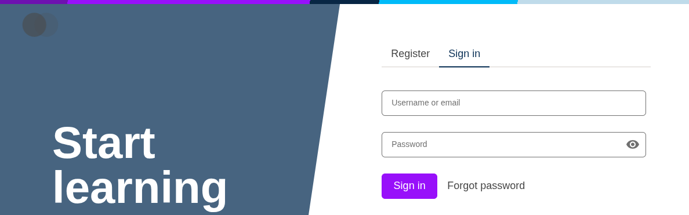

# brand-example-purple

A reference to [`openedx/sample-plugin`'s `brand-sample`](https://github.com/openedx/sample-plugin/tree/ccac8d42ad599257975aefb16d3a1831593db085/brand-sample) — the purple brand — applied to `frontend-app-authn` for the talk *Design Tokens: Plugin Slots but for your CSS*.

> [!NOTE]
> The link pins to a SHA from before [openedx/sample-plugin#47](https://github.com/openedx/sample-plugin/pull/47) changed `brand-sample` from purple to autumn, so the visuals here match the slide screenshots.

## Visual effect

## How to apply it

See the [upstream `brand-sample` README](https://github.com/openedx/sample-plugin/tree/ccac8d42ad599257975aefb16d3a1831593db085/brand-sample#readme) for install instructions — both the legacy `env.config.js` and `frontend-base` paths are documented there.
