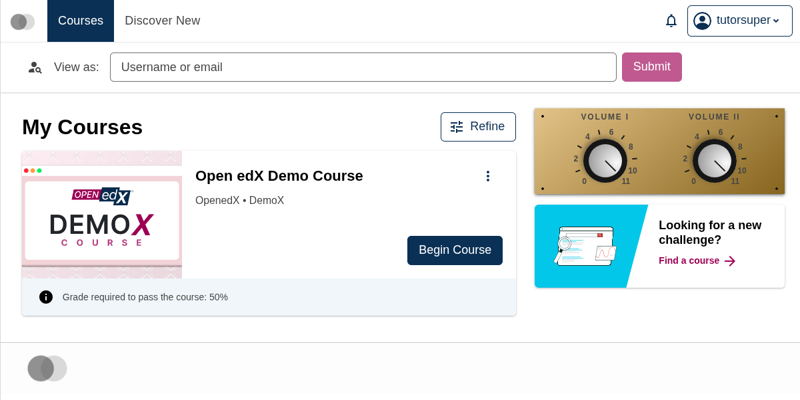

# brand-up-to-eleven

A Paragon brand package companion to [`plugin-knobby/`](../plugin-knobby/) — turns both of the plugin's volume knobs up to 11.

This brand exists as a concrete artifact for the talk *Design Tokens: Plugin Slots but for your CSS*. It demonstrates that a plugin which ships its own design tokens can be re-targeted by a brand package at runtime, without touching the plugin's component code.

## What it overrides

| Token | Plugin default | This brand |
|---|---|---|
| `--knobby-plugin-volume-i-knob` | `4` | `11` |
| `--knobby-plugin-volume-ii-knob` | `4` | `11` |

Two number overrides — that's the entire surface this brand touches.

## Visual effect

Plugin alone, both knobs at their default value `4`:


Plugin + brand applied, both knobs swung to `11`:



The plugin's React component is identical between these two frames. Only the values of the two `--knobby-plugin-volume-*-knob` CSS custom properties changed — which the plugin's `transform: rotate(calc(...))` then converts into the visible rotation.

## How to apply it

Add `PARAGON_THEME_URLS` to the `config` object in the `env.config.jsx` you used to install [`plugin-knobby/`](../plugin-knobby/). This loads the custom properties at runtime from [jsDelivr](https://www.jsdelivr.com/):

```jsx
PARAGON_THEME_URLS: {
  variants: {
    light: {
      urls: {
        default: 'https://cdn.jsdelivr.net/npm/@openedx/paragon@latest/dist/light.min.css',
        brandOverride: 'https://cdn.jsdelivr.net/gh/brian-smith-tcril/design-tokens-talk-2026@f0ae2502f6bb2c0dbcaf02b23a2596480a91ed16/brand-up-to-eleven/dist/light.min.css',
      },
    },
  },
},
```

The `brandOverride` URL pulls in new values for the two `--knobby-plugin-volume-*-knob` tokens. The plugin's `var(--knobby-plugin-volume-*-knob, 4)` calls then resolve to `11` instead of falling back to the default `4`.
