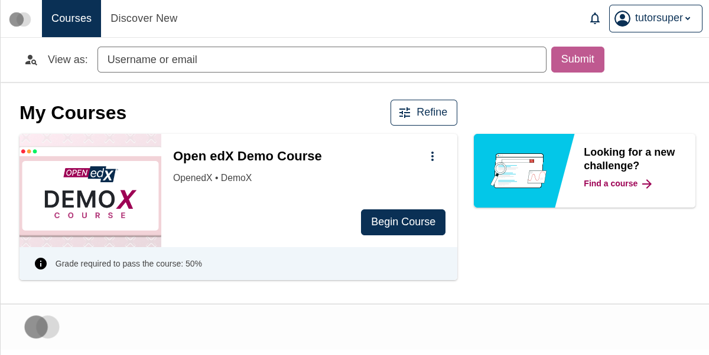
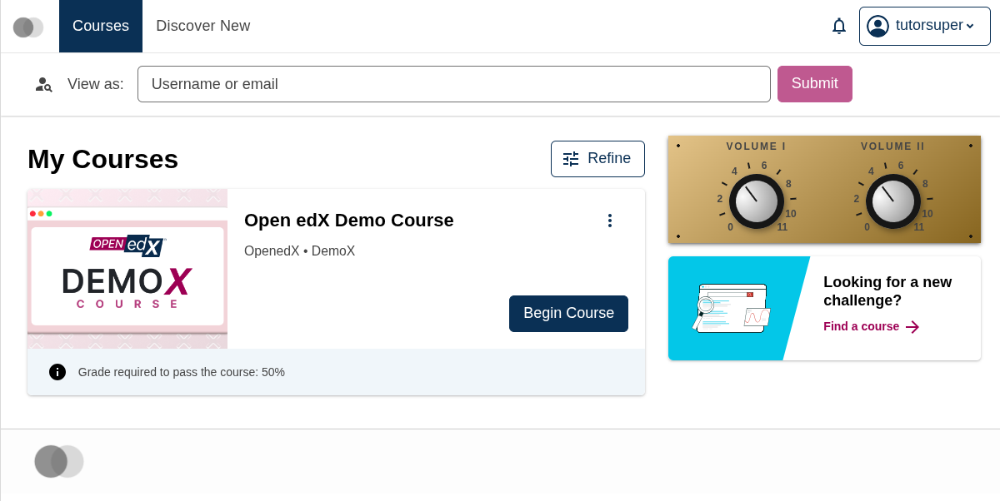

# Knobby

A demo plugin for the Open edX learner dashboard's right sidebar that renders two volume-style knobs — and ships its own design tokens that a brand package can re-target at runtime.

This plugin exists as a concrete artifact for the talk *Design Tokens: Plugin Slots but for your CSS*. The whole thing fits in a single `env.config.jsx` file (~115 lines) — no separate package, no separate stylesheet.

## What it looks like

Without the plugin — just the dashboard's default sidebar widget (`LookingForChallengeWidget`):



With the plugin installed — Knobby renders above the default widget, both knobs at their default value `4`:



With a brand package re-targeting both tokens to `11`:


The brand package only changes the values of the two CSS custom properties this plugin ships — the plugin itself is the same component in all three frames. See [`up-to-eleven-brand/`](../up-to-eleven-brand/) for the brand side of that story.

## Tokens shipped

| Token | Type | Default |
|---|---|---|
| `--knobby-plugin-volume-i-knob` | unitless number, `0`..`11` | `4` |
| `--knobby-plugin-volume-ii-knob` | unitless number, `0`..`11` | `4` |

Each token's value is *literally the number the knob points to* on its 0..11 dial. Defaults are encoded as the `var()` fallback at the consumption site — there are no `:root` declarations in the plugin's CSS.

## Installation

Paste the following into the host MFE's `env.config.jsx`. It registers Knobby in the `widget_sidebar.v1` slot alongside the default widget:

```jsx
import { DIRECT_PLUGIN, PLUGIN_OPERATIONS } from '@openedx/frontend-plugin-framework';
import { Card } from '@openedx/paragon';

const panelCss = `
  .knobby-plugin {
    display: flex;
    gap: 4rem;
    justify-content: center;
    padding: 4px 2rem 0;
    background:
      radial-gradient(circle at 12px 12px, #1a1610 2px, transparent 2px),
      radial-gradient(circle at calc(100% - 12px) 12px, #1a1610 2px, transparent 2px),
      radial-gradient(circle at 12px calc(100% - 8px), #1a1610 2px, transparent 2px),
      radial-gradient(circle at calc(100% - 12px) calc(100% - 8px), #1a1610 2px, transparent 2px),
      linear-gradient(140deg, #e3c388, #87651f);
    box-shadow: 0 2px 5px rgba(0,0,0,.4);
  }
`;

const controlCss = `
  .knobby-control { display: flex; flex-direction: column; align-items: center; gap: 6px; }
  .knobby-control__label { font-size: 12px; font-weight: 800; letter-spacing: .15em; }
`;

const faceCss = `
  .knobby-control__face { position: relative; width: 100px; height: 100px; }
  .knobby-control__numeral {
    position: absolute;
    top: 50%;
    left: 50%;
    font-size: 12px;
    font-weight: 800;
    transform: translate(-50%, -50%) rotate(var(--angle)) translateY(-44px) rotate(calc(-1 * var(--angle)));
  }
  .knobby-control__tick {
    position: absolute;
    top: 50%;
    left: 50%;
    width: 2px;
    height: 7px;
    background: #1a1a1a;
    transform: translate(-50%, -50%) rotate(var(--angle)) translateY(-44px);
  }
`;

const knobCss = `
  .knobby-control__knob {
    position: absolute;
    inset: 17px;
    border-radius: 50%;
    background: radial-gradient(circle at 35% 28%, #fafafa, #6e6e6e);
    box-shadow: inset 0 0 0 8px #161616, 0 4px 8px rgba(0,0,0,.4);
    transform: rotate(calc(-135deg + var(--knob-value) * (270deg / 11)));
  }
  .knobby-control__knob::after {
    content: '';
    position: absolute;
    top: 11px;
    left: 50%;
    width: 2px;
    height: 22px;
    background: #1a1a1a;
    transform: translateX(-50%);
  }
`;

const Panel = ({ children }) => <div className="knobby-plugin">{children}</div>;

const NUMERALS = [0, 2, 4, 6, 8, 10, 11];
const TICKS = [1, 3, 5, 7, 9];
const angleOf = (n) => `${-135 + n * 270 / 11}deg`;

const Knob = ({ value, label }) => (
  <div className="knobby-control" style={{ '--knob-value': value }}>
    <div className="knobby-control__label">{label}</div>
    <div className="knobby-control__face">
      {NUMERALS.map((n) => <span key={n} className="knobby-control__numeral" style={{ '--angle': angleOf(n) }}>{n}</span>)}
      {TICKS.map((n) => <span key={n} className="knobby-control__tick" style={{ '--angle': angleOf(n) }} />)}
      <div className="knobby-control__knob" />
    </div>
  </div>
);

const Knobby = () => (
  <>
    <style>{`${panelCss}${controlCss}${faceCss}${knobCss}`}</style>
    <Card orientation="horizontal" className="mb-3">
      <Card.Body>
        <Panel>
          <Knob value="var(--knobby-plugin-volume-i-knob, 4)" label="VOLUME I" />
          <Knob value="var(--knobby-plugin-volume-ii-knob, 4)" label="VOLUME II" />
        </Panel>
      </Card.Body>
    </Card>
  </>
);

const config = {
  pluginSlots: {
    'org.openedx.frontend.learner_dashboard.widget_sidebar.v1': {
      keepDefault: true,
      plugins: [
        {
          op: PLUGIN_OPERATIONS.Insert,
          widget: {
            id: 'knobby_plugin',
            priority: 10,
            type: DIRECT_PLUGIN,
            RenderWidget: Knobby,
          },
        },
      ],
    },
  },
};

export default config;
```

The two `<Knob value="var(--knobby-plugin-volume-*-knob, 4)" />` lines are where the plugin's tokens are consumed — that's the entire surface a brand package can theme.
