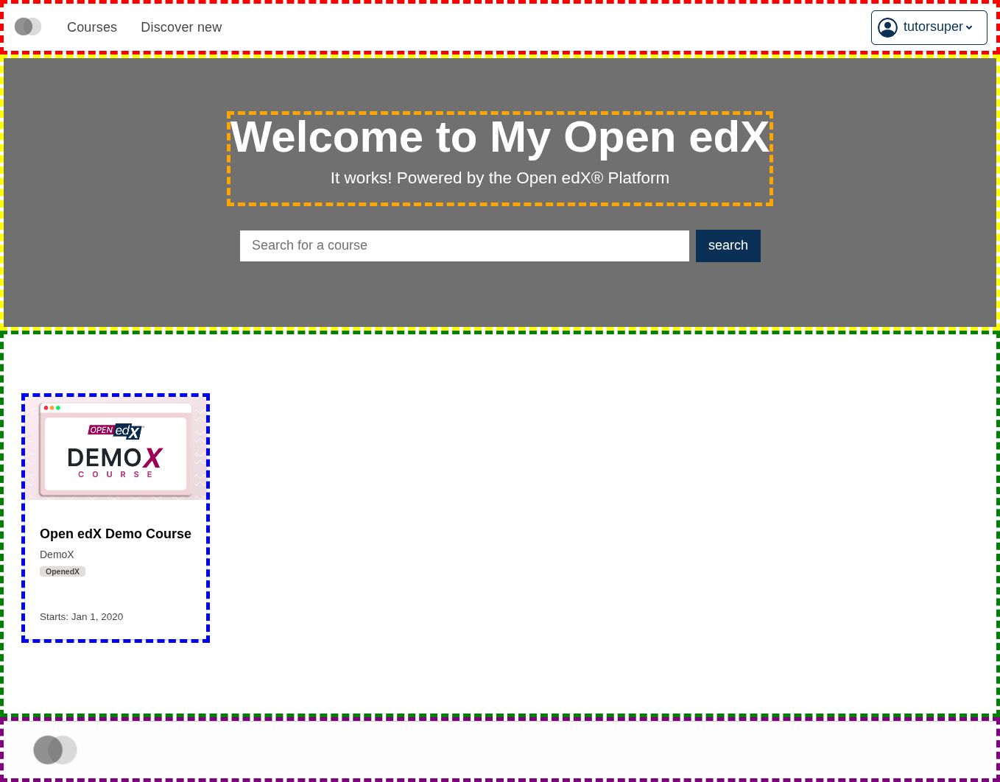

# plugin-catalog-slot-highlighter

A debug plugin that wraps each [`frontend-app-catalog`](https://github.com/openedx/frontend-app-catalog) home page slot's default contents in a thick dashed colored border — useful as a visual reference for where the slots are and how they nest.



Paste into `frontend-app-catalog`'s `env.config.jsx`:

```jsx
import { PLUGIN_OPERATIONS } from '@openedx/frontend-plugin-framework';

const config = {
  pluginSlots: {
    'org.openedx.frontend.layout.header_desktop.v1': {
      keepDefault: true,
      plugins: [
        {
          op: PLUGIN_OPERATIONS.Wrap,
          widgetId: 'default_contents',
          wrapper: ({ component }) => <div style={{ border: 'thick dashed red' }}>{component}</div>,
        },
      ]
    },
    'org.openedx.frontend.catalog.home_page.overlay_html': {
      keepDefault: true,
      plugins: [
        {
          op: PLUGIN_OPERATIONS.Wrap,
          widgetId: 'default_contents',
          wrapper: ({ component }) => <div style={{ border: 'thick dashed orange' }}>{component}</div>,
        },
      ]
    },
    'org.openedx.frontend.catalog.home_page.banner': {
      keepDefault: true,
      plugins: [
        {
          op: PLUGIN_OPERATIONS.Wrap,
          widgetId: 'default_contents',
          wrapper: ({ component }) => <div style={{ border: 'thick dashed yellow' }}>{component}</div>,
        },
      ]
    },
    'org.openedx.frontend.catalog.home_page.courses_list': {
      keepDefault: true,
      plugins: [
        {
          op: PLUGIN_OPERATIONS.Wrap,
          widgetId: 'default_contents',
          wrapper: ({ component }) => <div style={{ border: 'thick dashed green' }}>{component}</div>,
        },
      ]
    },
    'org.openedx.frontend.catalog.home_page.course_card': {
      keepDefault: true,
      plugins: [
        {
          op: PLUGIN_OPERATIONS.Wrap,
          widgetId: 'default_contents',
          wrapper: ({ component }) => <div style={{ border: 'thick dashed blue' }}>{component}</div>,
        },
      ]
    },
    'org.openedx.frontend.layout.footer.v1': {
      keepDefault: true,
      plugins: [
        {
          op: PLUGIN_OPERATIONS.Wrap,
          widgetId: 'default_contents',
          wrapper: ({ component }) => <div style={{ border: 'thick dashed purple' }}>{component}</div>,
        },
      ]
    },
  },
}

export default config;
```
